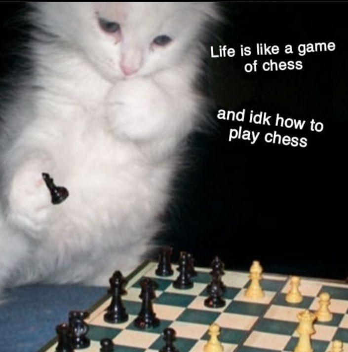

# ChessNet
Attempt at networking in C++ with a classic chess game.  
Tested with gcc(9.3.0) on linux.  

## Thanks and Inspirations
Huge thanks to OneLoneCoder ([JavidX9](https://github.com/OneLoneCoder)) and his [video series](https://youtu.be/2hNdkYInj4g) on Networking in C++ using ASIO.  
The Networking module of this project has been inspired from his [olcPixelGameEngine](https://github.com/OneLoneCoder/olcPixelGameEngine).  
  
  
And Bryan Ford for his amazing [paper](https://bford.info/pub/net/p2pnat/index.html) on NAT Traversal techniques.  

## How to build
Download and Install ASIO from [here](https://think-async.com/Asio/)  or from Boost C++ library.  
or check your package manager for easier setup.  
Make sure Qt is installed and properly configured. (preferably Qt 6.1.3)  

##### To Build
Clone the repository.  
Navigate to repo directory.  
Type the following commands in terminal :

```
mkdir Build && cd Build  
cmake ..  
cmake --build .  
```  
You might have to edit `CMakeLists.txt` in order to get it working.  

## Run 
Once you've built the executables, you're ready to start playing!  
The `ChessNet-server` is the host side of the game.  Use it to host the game.  
The Server-side application sets up the game and waits for the opponent to connect.  

The `ChessNet-client` is the client side of the game.  Use it to connect to a game and start playing.  
The Client-side asks for the IP address, connects and starts the game if IP is valid and is accepting connections.  

 **Note :** 
 >Both IPv4 and IPv6 are supported. 
 However, due to some problems explained below, prefer IPv6.   
 Connecting over global network might be troublesome.  I believe this has to do with NAT and its shortcomings to provide a proper P2P connection.
 It's tedious and annoying so I'll probably add a better alternative sometime later.  
 Probably..
 Things I have in mind :  
> - Hole Punching and other NAT traversal algorithms
>
>Till then, use port forwarding to forward port 60000 to your server side machine.  
>  ~~OR, Just disable NAT on server side networks and use IPv6.~~  

## How to Play

  


## Some Issues and plans

> - Game never ends 
> - I killed the king
> - would like a clock that ticks down the seconds you have left
> - Game logic is not perfect 
> - Need a parity check to ensure valid game states between the two players.
> - Gotta make Spectator mode, and something to simplify connections?  
> - ~~IPv6 only for now. DNS issues with IPv4. Will sort that out.~~
> - ~~Multiple clients on same machine will conflict. Need to find a way to check foreground terminal window.~~
